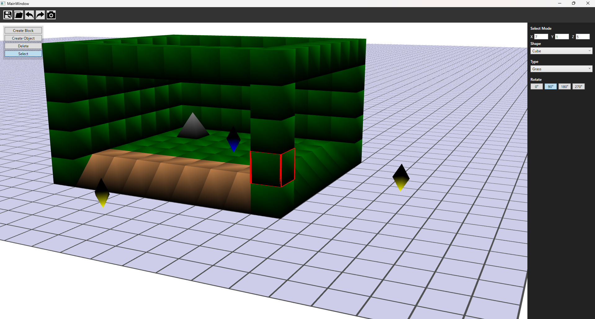

# 🎨 WPF Level Editor

WPF を用いて制作した **3D グリッドベースのレベルエディタ** です。  
プランナーがレベルを構築し、そのデータを Houdini → Unreal Engine へ連携することを想定して設計しました。

---

## 📌 概要

- 制作期間: 約1ヶ月  
- 担当: 個人制作  
- 開発環境: WPF / C# / .NET 8  
- データ形式: JSON  
- 外部連携: Python（CSV変換）→ Houdini  

---

## 🎯 開発の目的

- WPF を用いた 3D ツール開発の基礎習得
- **WPF → Houdini → UE を想定したデータ連携設計の理解**
- レベル編集データを外部ツールで活用可能な形式で出力する設計
- Houdiniの基本的な使用方法と簡単なプロシージャル生成の習得

---

## 🛠 機能

### ■ レベル編集

- 3D Viewport 上での Block / Object の配置・削除  
- 整数グリッドベースの配置  
- カメラ移動 / 回転 / ズーム操作  
- Undo / Redo 機能  
- JSON 形式での Import / Export  

---

### ■ UX / 編集補助機能

- **配置前のゴースト表示機能**  
  → マウス位置に半透明で配置予定オブジェクトを表示し、誤配置を防止  

- **編集UIからの直接数値変更**  
  → 選択中の Block / Object の  
     - 位置（X, Y, Z）  
     - 各種プロパティ  
     をUI上から直接変更可能  

- **オブジェクトごとの配置数制限機能**  
  → 特定オブジェクトの最大配置数を制御  
  → レベル設計上の制約を再現  

---

### ■ データ構造

- レベルデータを JSON 形式で出力  
- オブジェクト情報を構造化して管理  
- Import により再読み込み可能  

---

### ■ Houdini 連携

1. JSON を Export  
2. Python スクリプトで CSV に変換  
3. Houdini で CSV を読み込み  
4. WPF 上のレベルと同様のモデルを自動生成  

---

### ■ 想定パイプライン
WPF（レベル作成）  
↓ JSON Export  
Python（CSV 変換）  
↓  
Houdini（モデル生成）  
↓  
Unreal Engine（ゲーム利用想定）

---

## 💡 技術的な工夫

- Raycast による 3D 空間上の正確な選択処理を実装
- Undo / Redo を Command パターンで管理

特に Undo / Redo 機能は、Block / Object ごとに操作履歴を分離し、拡張可能な構造で設計しました。

---

## 🧠 設計思想

本プロジェクトは **MVVM（Model-View-ViewModel）アーキテクチャ** を意識して設計しています。

### ■ MVVM 採用理由

- UIロジックと描画ロジックの分離
- View 依存を減らし、保守性・拡張性を向上
- 将来的な機能追加を想定した責務分離

View には描画とバインディングのみを持たせ、
編集処理や状態管理は ViewModel および Service 層に集約しています。

---

### ■ レイヤー構成

- **Models**  
  レベルデータ・Block / Object のデータ構造を定義  
  JSON シリアライズを前提とした構造設計  

- **ViewModels**  
  UI とデータの仲介  
  コマンド処理、状態管理、選択状態の保持  

- **Services**  
  - Save / Load  
  - Undo / Redo  
  - 配置制御ロジック  
  など、ビジネスロジックを分離  

- **3D モジュール**  
  描画・Raycast・Scene管理を独立構成  
  UI 層と直接依存しない設計  

---

### ■ 想定ゲーム

本エディタは以下のようなゲームを想定しています：

> プレイヤーが武器やアイテムを使用し、  
> 湧いてくる敵から拠点オブジェクトを防衛するゲーム

そのため：

- 拠点オブジェクトの一意性管理（配置数制限）
- 敵出現ポイントの明確な配置
- グリッドベースでの戦略的配置
- レベルデータの外部エンジン連携

などを意識した設計としています。

---

## ⚠ 現状の課題

- Unreal Engine への直接連携は未実装
- 大規模マップでのパフォーマンス検証は未実施
- オブジェクトの階層管理機能は未実装

---

### ■ 今後の展望

- Unreal Engine へ直接インポート可能なデータ形式の実装
- Houdini 連携を強化し、より整った見た目を自動生成するプロシージャル処理の導入
- ゲームロジックと連携したデータバリデーション機能の追加
- Prefab / テンプレート機能の実装

本ツールを「単体エディタ」ではなく、
ゲーム開発パイプラインの一部として発展させることを目標としています。

---

## 🎥 デモ
以下は実際の操作デモです。

